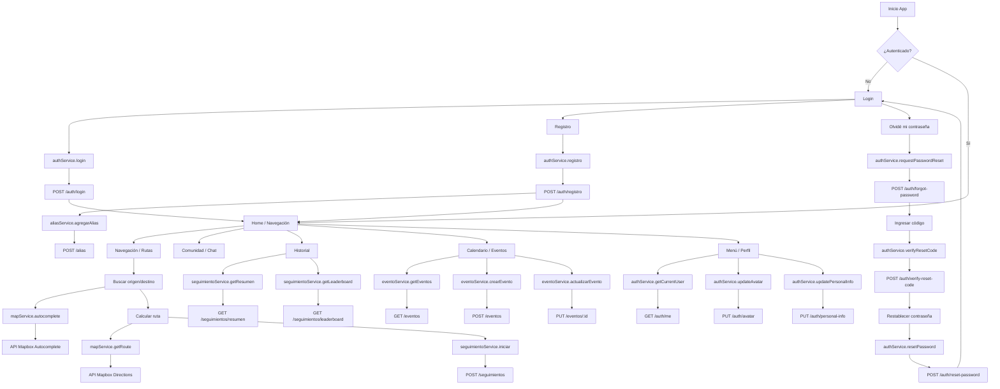

# Diagrama de Flujo de la App y Diseño de Tablas

## Diagrama de flujo (App) con servicios/métodos

## Diseño de tablas (PostgreSQL)

> Basado en `esquema-sql-postgresql.sql` (con PostGIS).

### Tipos ENUM
- `tipo_sexo`: masculino | femenino | ambos
- `tipo_nacionalidad`: español | inglés
- `tipo_perfil`: administrador | liderGrupo | roller
- `estado_ruta`: planificada | enProgreso | completada
- `estado_grupo`: activo | finalizado | cancelado
- `estado_producto`: disponible | vendido | reservado
- `estado_transaccion`: pendiente | completada | cancelada | reembolsada

### Tablas principales

#### `usuarios`
| Campo | Tipo | Notas |
|---|---|---|
| id | UUID | PK |
| email | VARCHAR(255) | Único |
| password_hash | VARCHAR(255) | Obligatorio |
| edad | INTEGER | >= 13 |
| cumpleaños | DATE | Obligatorio |
| sexo | tipo_sexo | Obligatorio |
| nacionalidad | tipo_nacionalidad | Obligatorio |
| tipo_perfil | tipo_perfil | Default: roller |
| foto_perfil | TEXT | Opcional |
| logo | TEXT | Opcional |
| fecha_registro | TIMESTAMPTZ | Default NOW |
| created_at / updated_at | TIMESTAMPTZ | Auditoría |

#### `rutas`
| Campo | Tipo | Notas |
|---|---|---|
| id | UUID | PK |
| nombre | VARCHAR(255) | Obligatorio |
| descripcion | TEXT | Opcional |
| origen_lat / origen_lng | DECIMAL | Obligatorio |
| destino_lat / destino_lng | DECIMAL | Obligatorio |
| distancia | DECIMAL(10,2) | km |
| duracion_estimada | INTEGER | min |
| creador_id | UUID | FK → usuarios.id |
| estado | estado_ruta | Default planificada |
| created_at / updated_at | TIMESTAMPTZ | Auditoría |

#### `recorridos`
| Campo | Tipo | Notas |
|---|---|---|
| id | UUID | PK |
| usuario_id | UUID | FK → usuarios.id |
| ruta_id | UUID | FK → rutas.id (nullable) |
| distancia_real | DECIMAL(10,2) | km |
| duracion_real | INTEGER | seg |
| fecha_inicio / fecha_fin | TIMESTAMPTZ | |
| velocidad_promedio / maxima | DECIMAL(6,2) | km/h |
| created_at / updated_at | TIMESTAMPTZ | Auditoría |

#### `puntos_gps`
| Campo | Tipo | Notas |
|---|---|---|
| id | UUID | PK |
| recorrido_id | UUID | FK → recorridos.id |
| lat / lng | DECIMAL | Obligatorio |
| timestamp | TIMESTAMPTZ | Obligatorio |
| orden | INTEGER | Secuencia |
| created_at | TIMESTAMPTZ | Auditoría |

#### `grupos_rodadas`
| Campo | Tipo | Notas |
|---|---|---|
| id | UUID | PK |
| nombre | VARCHAR(255) | Obligatorio |
| lider_id | UUID | FK → usuarios.id |
| ruta_id | UUID | FK → rutas.id |
| fecha_hora_inicio | TIMESTAMPTZ | Obligatorio |
| estado | estado_grupo | Default activo |
| created_at / updated_at | TIMESTAMPTZ | Auditoría |

#### `participantes_grupo`
| Campo | Tipo | Notas |
|---|---|---|
| id | UUID | PK |
| grupo_id | UUID | FK → grupos_rodadas.id |
| usuario_id | UUID | FK → usuarios.id |
| fecha_union | TIMESTAMPTZ | Default NOW |
| created_at | TIMESTAMPTZ | Auditoría |
| UNIQUE | (grupo_id, usuario_id) | |

#### `eventos`
| Campo | Tipo | Notas |
|---|---|---|
| id | UUID | PK |
| titulo | VARCHAR(255) | Obligatorio |
| descripcion | TEXT | Opcional |
| fecha | DATE | Obligatorio |
| hora | TIME | Obligatorio |
| punto_encuentro_lat / lng | DECIMAL | Obligatorio |
| punto_encuentro_direccion | VARCHAR(500) | Opcional |
| organizador_id | UUID | FK → usuarios.id |
| created_at / updated_at | TIMESTAMPTZ | Auditoría |

#### `participantes_evento`
| Campo | Tipo | Notas |
|---|---|---|
| id | UUID | PK |
| evento_id | UUID | FK → eventos.id |
| usuario_id | UUID | FK → usuarios.id |
| fecha_registro | TIMESTAMPTZ | Default NOW |
| created_at | TIMESTAMPTZ | Auditoría |
| UNIQUE | (evento_id, usuario_id) | |

#### `productos`
| Campo | Tipo | Notas |
|---|---|---|
| id | UUID | PK |
| vendedor_id | UUID | FK → usuarios.id |
| titulo | VARCHAR(255) | Obligatorio |
| descripcion | TEXT | Opcional |
| categoria | VARCHAR(100) | Obligatorio |
| precio | DECIMAL(10,2) | >= 0 |
| estado | estado_producto | Default disponible |
| fecha_publicacion | TIMESTAMPTZ | Default NOW |
| created_at / updated_at | TIMESTAMPTZ | Auditoría |

#### `productos_imagenes`
| Campo | Tipo | Notas |
|---|---|---|
| id | UUID | PK |
| producto_id | UUID | FK → productos.id |
| url_imagen | TEXT | Obligatorio |
| orden | INTEGER | Default 0 |
| created_at | TIMESTAMPTZ | Auditoría |

#### `transacciones`
| Campo | Tipo | Notas |
|---|---|---|
| id | UUID | PK |
| producto_id | UUID | FK → productos.id |
| comprador_id | UUID | FK → usuarios.id |
| vendedor_id | UUID | FK → usuarios.id |
| monto | DECIMAL(10,2) | >= 0 |
| estado | estado_transaccion | Default pendiente |
| fecha_transaccion | TIMESTAMPTZ | Default NOW |
| created_at / updated_at | TIMESTAMPTZ | Auditoría |
| CHECK | comprador_id != vendedor_id | |

### Vistas
- `vista_estadisticas_usuarios`: resumen de recorridos por usuario.
- `vista_productos_con_imagen`: productos con imagen principal.

